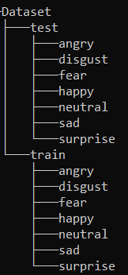

A simple way to create a SVM classifier to emotion recognition

# Instruction to train the model

### 1. once clone the repository download shape_predictor_68_face_landmarks.dat
### 2. create the Dataset of images containing a part of training and a part of test respecting this tree diagram

